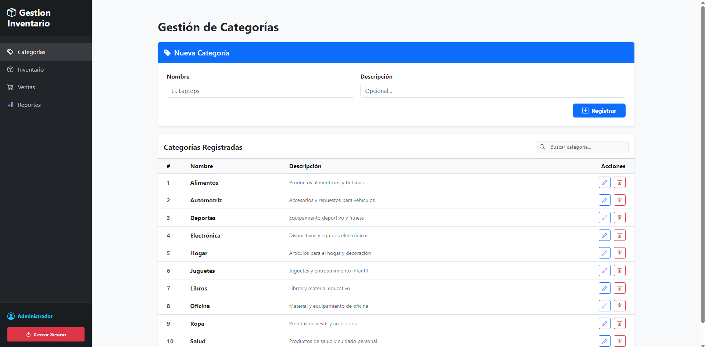
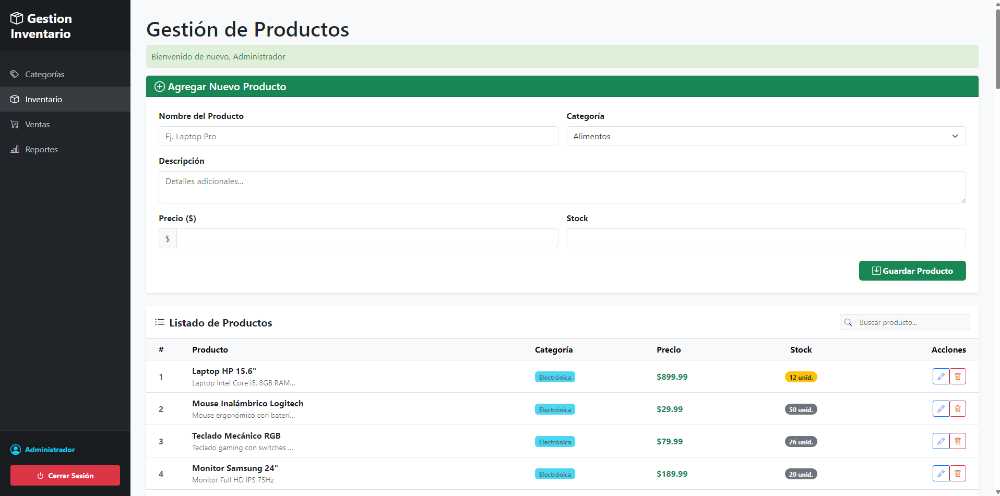
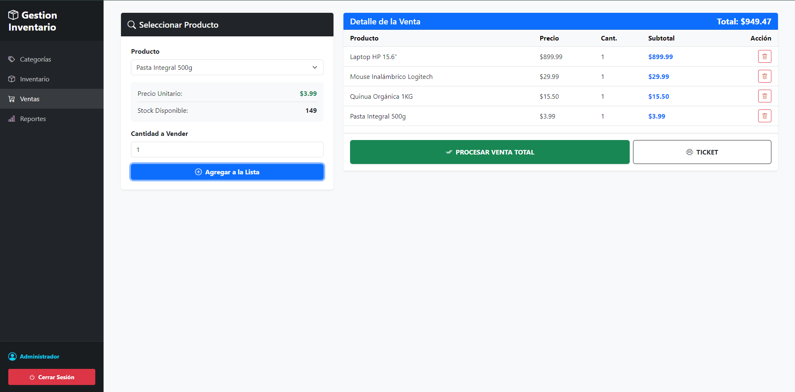

# 📦 Gestión de Inventario - Powered by Olyxis

**Gestión de Inventario powered by Olyxis** es una solución integral de nivel empresarial diseñada para el control preciso de existencias y la administración eficiente de ventas. Este sistema destaca por su robustez técnica y una interfaz moderna pensada en la productividad.

---

## 🚀 Arquitectura y Seguridad

El proyecto está construido sobre el **Framework Olyxis**, un motor personalizado desarrollado en **PHP 8.x** bajo el patrón de diseño **MVC (Modelo-Vista-Controller)**.

### Características de Seguridad

- 🛡️ **Middlewares de Seguridad**: Implementación de capas de control que interceptan las peticiones para validar sesiones y cookies, evitando accesos no autorizados a rutas críticas.
- 🔑 **Gestión de Sesiones**: Control persistente y seguro de usuarios autenticados.
- ⚙️ **Lógica en Base de Datos**: Uso extensivo de Procedimientos Almacenados en MySQL para garantizar transacciones atómicas y un alto rendimiento en el procesamiento de datos.

---

## 🛠️ Funcionalidades Principales

### 📦 Control de Inventario y Catálogos

- **Gestión de Productos**: CRUD completo (Crear, Leer, Actualizar, Eliminar) con control de stock.
- **Gestión de Categorías**: Organización lógica y escalable de todos los insumos del sistema.

### 💰 Módulo de Ventas Avanzado

- **Venta Multi-producto**: Capacidad de procesar múltiples artículos en una sola transacción en tiempo real.
- **Validación de Stock**: El sistema verifica la disponibilidad de existencias antes de confirmar cualquier operación.
- **Generación de Vouchers**: Emisión de comprobantes de venta para cada transacción finalizada.

### 📊 Análisis y Reportes

- **Reportes de Ventas**: Módulo de consulta con filtrado por intervalos de tiempo, permitiendo analizar el rendimiento del negocio en fechas específicas.

---

## 📸 Vista Previa (Screenshots)

### Gestión de Categorías


### Panel de Inventario


### Módulo de Ventas


### Reportes Estadísticos


---

## 📥 Guía de Instalación y Uso

Para que el sistema funcione correctamente, sigue estos pasos:

### 1. Clonar el repositorio
```bash
git clone https://github.com/Javierborja09/Gestion-Inventario-powered-Olyxis.git
cd Gestion-Inventario-powered-Olyxis
```

### 2. Configurar la Base de Datos

Ejecuta el script SQL incluido en la raíz: `GestionInventario.sql`. Este creará las tablas y todos los Procedimientos Almacenados necesarios.

Crea un archivo llamado `.env` en la raíz del proyecto y configura tus credenciales:
```env
# Configuración de la Base de Datos
DB_HOST=127.0.0.1
DB_PORT=3306
DB_NAME=gestion_inventario
DB_USER=root
DB_PASSWORD=2109
```

### 3. Instalar Dependencias

Es obligatorio instalar las dependencias de Composer para el correcto funcionamiento del Autoload y el Framework:
```bash
composer install
```

### 4. Ejecutar el Servidor (Olyxis CLI)

Para visualizar el proyecto en funcionamiento, utiliza el comando de consola propio del framework:

**Opción rápida:**
```bash
php bin/olyxis serve
```

**Puerto personalizado:**
```bash
php bin/olyxis localhost 5000
```

---

## 👨‍💻 Desarrollador

Desarrollado con pasión por **PushOFDev**.

---

## 📄 Licencia

Este proyecto está bajo la licencia especificada en el repositorio.

---

## 🤝 Contribuciones

Las contribuciones son bienvenidas. Por favor, abre un issue o pull request para sugerencias y mejoras.

---

## 📞 Contacto

Para más información, visita el [repositorio oficial](https://github.com/Javierborja09/Gestion-Inventario-powered-Olyxis).
