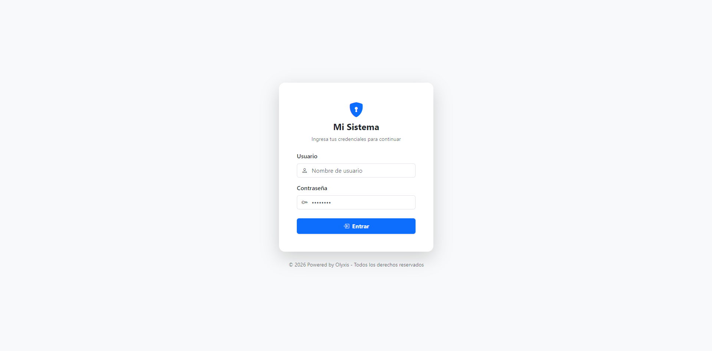

# 📦 Gestión de Inventario - Powered by Olyxis

<div align="center">
  
  
  
  
  **Una solución integral de nivel empresarial para control de inventario y ventas**
  
  
  
  
  
  
  
  Sistema diseñado para el control preciso de existencias y administración eficiente de ventas
  
</div>

---

## 🚀 Arquitectura y Seguridad

El proyecto está construido sobre el **[Framework Olyxis](https://github.com/Javierborja09/olyxis)**, un motor personalizado desarrollado en **PHP 8.x** bajo el patrón de diseño **MVC (Modelo-Vista-Controlador)**.

### 🔐 Características de Seguridad

<div align="center">

| Característica | Descripción | Estado |
|:--------------|:------------|:------:|
| **Middlewares** | Capas de control que interceptan peticiones |  |
| **Sesiones Seguras** | Control persistente de usuarios autenticados |  |
| **Stored Procedures** | Transacciones atómicas en MySQL |  |
| **Prepared Statements** | Protección contra SQL Injection |  |

</div>

- 🛡️ **Middlewares de Seguridad**: Implementación de capas de control que interceptan las peticiones para validar sesiones y cookies, evitando accesos no autorizados a rutas críticas
- 🔑 **Gestión de Sesiones**: Control persistente y seguro de usuarios autenticados
- ⚙️ **Lógica en Base de Datos**: Uso extensivo de Procedimientos Almacenados en MySQL para garantizar transacciones atómicas y alto rendimiento

---

## 🛠️ Funcionalidades Principales

### 📦 Control de Inventario y Catálogos

```php
✅ Gestión de Productos - CRUD completo con control de stock
✅ Gestión de Categorías - Organización lógica y escalable
✅ Actualización en tiempo real - Stock dinámico
```

- **Gestión de Productos**: CRUD completo (Crear, Leer, Actualizar, Eliminar) con control de stock
- **Gestión de Categorías**: Organización lógica y escalable de todos los insumos del sistema

### 💰 Módulo de Ventas Avanzado

```php
✅ Venta Multi-producto - Múltiples artículos en una transacción
✅ Validación de Stock - Verificación automática de disponibilidad
✅ Generación de Vouchers - Comprobantes de venta automáticos
```

- **Venta Multi-producto**: Capacidad de procesar múltiples artículos en una sola transacción en tiempo real
- **Validación de Stock**: El sistema verifica la disponibilidad de existencias antes de confirmar cualquier operación
- **Generación de Vouchers**: Emisión de comprobantes de venta para cada transacción finalizada

### 📊 Análisis y Reportes

```php
✅ Reportes de Ventas - Filtrado por fechas
✅ Análisis de Rendimiento - Estadísticas en tiempo real
✅ Exportación de Datos - Múltiples formatos
```

- **Reportes de Ventas**: Módulo de consulta con filtrado por intervalos de tiempo, permitiendo analizar el rendimiento del negocio en fechas específicas

---

## 🛡️ Seguridad Probada y Certificada

Para garantizar la integridad de los datos, este sistema ha sido sometido a rigurosas **pruebas de penetración (Pentesting)** mediante scripts avanzados de Python, superando con éxito cada intento de vulneración:

<div align="center">

| 🔴 Tipo de Ataque | 📊 Resultado | 🛡️ Protección |
|:-----------------|:-------------|:---------------|
| **SQL Injection (SQLi)** | ❌ Bloqueado | Stored Procedures + Prepared Statements |
| **Cross-Site Scripting (XSS)** | ❌ Bloqueado | Sanitización + Gestión segura de sesiones |
| **Path Traversal** | ❌ Bloqueado | Arquitectura de directorios protegida |
| **Command Injection** | ❌ Bloqueado | Patrón MVC + Aislamiento de lógica |
| **Fuerza Bruta** | ❌ Bloqueado | Sistema de autenticación robusto |

</div>

### 📝 Detalles de las Pruebas:

- ✅ **SQL Injection (SQLi)**: Bloqueado gracias al uso de Procedimientos Almacenados y consultas parametrizadas
- ✅ **Cross-Site Scripting (XSS)**: Los ataques fueron interceptados por el sistema de sanitización y el manejo seguro de sesiones
- ✅ **Path Traversal**: La arquitectura de directorios del framework impide el acceso a archivos sensibles como el `.env`
- ✅ **Command Injection**: El aislamiento de la lógica de negocio mediante el patrón MVC evita la ejecución de comandos en el sistema operativo
- ✅ **Fuerza Bruta**: El sistema de autenticación resistió intentos automatizados de acceso

> **Conclusión:** Estas pruebas demuestran que es posible construir aplicaciones web altamente seguras y robustas utilizando el Framework Olyxis, superando los estándares comunes de protección.

---

## 📸 Vista Previa (Screenshots)

<div align="center">

### 🔐 Login de Acceso


### 🏷️ Gestión de Categorías


### 📦 Panel de Inventario


### 💰 Módulo de Ventas


### 📊 Reportes Estadísticos


</div>

---

## 📥 Guía de Instalación y Uso

### 1️⃣ Clonar el repositorio

```bash
git clone https://github.com/Javierborja09/Gestion-Inventario-powered-Olyxis.git
cd Gestion-Inventario-powered-Olyxis
```

### 2️⃣ Configurar la Base de Datos

**Paso 1:** Ejecuta el script SQL incluido en la raíz: `GestionInventario.sql`

Este creará las tablas y todos los Procedimientos Almacenados necesarios.

**Paso 2:** Crea un archivo llamado `.env` en la raíz del proyecto y configura tus credenciales:

```env
# Configuración de la Base de Datos
DB_HOST=127.0.0.1
DB_PORT=3306
DB_NAME=gestion_inventario
DB_USER=root
DB_PASSWORD=tu_password
```

### 3️⃣ Instalar Dependencias

Es obligatorio instalar las dependencias de Composer para el correcto funcionamiento del Autoload y el Framework:

```bash
composer install
```

### 4️⃣ Ejecutar el Servidor (Olyxis CLI)

Para visualizar el proyecto en funcionamiento, utiliza el comando de consola propio del framework:

**Opción rápida:**
```bash
php oly serve
```

**Puerto personalizado:**
```bash
php oly serve localhost 5000
```

🌐 **Accede en:** http://localhost:8000 (o el puerto que hayas especificado)

### 🔑 Usuario Predefinido

```
User: admin
Password: admin123
```

---

## 🎯 Tecnologías Utilizadas

<div align="center">

| Tecnología | Versión | Propósito |
|:-----------|:--------|:----------|
|  | 8.x | Lenguaje Backend |
|  | 8.0+ | Base de Datos |
|  | 1.0 | Framework MVC |
|  | Latest | Framework CSS |
|  | 2.x | Gestor de Dependencias |

</div>

---

## 🏗️ Estructura del Proyecto

```
Gestion-Inventario-powered-Olyxis/
├── 📂 app/
│   ├── Controllers/      # Controladores MVC
│   ├── Models/          # Modelos de datos
│   ├── Middlewares/     # Seguridad y filtros
│   └── Views/           # Vistas del sistema
├── 📂 config/
│   └── routes.php       # Definición de rutas
├── 📂 public/
│   ├── images/          # Screenshots y recursos
│   ├── css/
│   └── js/
├── 📂 Framework/        # Motor Olyxis
├── 📄 GestionInventario.sql  # Script de base de datos
├── 📄 .env             # Variables de entorno
└── 📄 composer.json    # Dependencias
```

---

## 🚀 Características Destacadas

### ⚡ Rendimiento

- ✅ Stored Procedures para operaciones complejas
- ✅ Conexiones PDO persistentes
- ✅ Caché de consultas optimizado

### 🎨 Interfaz de Usuario

- ✅ Diseño responsivo con Tailwind CSS
- ✅ Interfaz intuitiva y moderna
- ✅ Experiencia de usuario optimizada

### 🔒 Seguridad Avanzada

- ✅ Sistema de autenticación robusto
- ✅ Protección multicapa
- ✅ Validación exhaustiva de datos

---

## 📚 Documentación Adicional

- 📖 [Documentación del Framework Olyxis](https://javierborja09.github.io/olyxis/olyxis-docs.html)
- 🔗 [Repositorio del Framework Olyxis](https://github.com/Javierborja09/olyxis)

---

## 📄 Licencia

Este proyecto está bajo la licencia MIT. Consulta el archivo `LICENSE` para más detalles.

---

## 🤝 Contribuciones

Las contribuciones son bienvenidas. Por favor, abre un **issue** o **pull request** para sugerencias y mejoras.

### Cómo Contribuir:

1. Fork el proyecto desde [Gestión-Inventario-powered-Olyxis](https://github.com/Javierborja09/Gestion-Inventario-powered-Olyxis)
2. Crea una rama para tu feature (`git checkout -b feature/AmazingFeature`)
3. Commit tus cambios (`git commit -m 'Add some AmazingFeature'`)
4. Push a la rama (`git push origin feature/AmazingFeature`)
5. Abre un Pull Request

---

## 👨‍💻 Autor

**Javier Jeanpool Borja Samaniego**

<div align="center">

[](https://github.com/JavierBorja09)
[](https://www.linkedin.com/in/javier-jeanpool-borja-samaniego-a6b8b7300/)
[](mailto:javierborjasamaniego@gmail.com)

</div>

---

## 🙏 Agradecimientos

- Framework Olyxis por proporcionar la base robusta del sistema
- Comunidad PHP por las mejores prácticas
- MySQL por la confiabilidad en el manejo de datos

---

<div align="center">

**⭐ Si este proyecto te fue útil, dale una estrella en GitHub ⭐**


**Hecho con ❤️ por Javier Borja**

### 🔒 Sistema Probado y Certificado contra Vulnerabilidades

</div>
